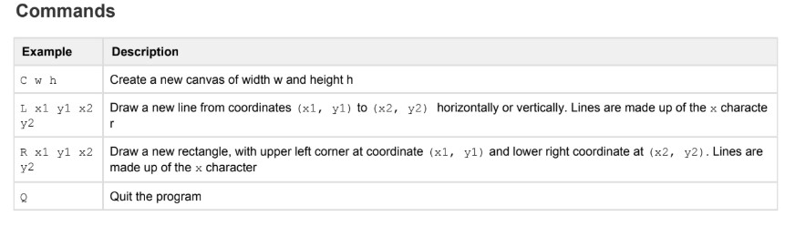
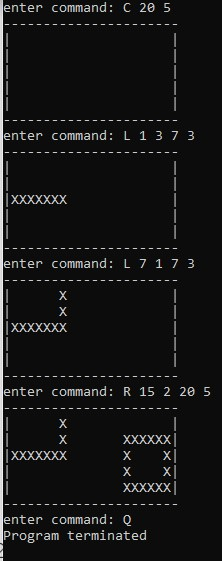

## Coding Problem: Canvas
- This program creates a Canvas and draws lines and rectangles corresponding to the coordinates given.

## Run the project
- Install Maven if not installed already: https://maven.apache.org/install.html
- Clone the project
- From the root directory, run `mvn clean package`, this will clean the project and package the project into an executable jar file
- The jar will be created under the folder `target/Canvas-1.0.0-shaded.jar` which 
you can run the program

- To run the program, run use the following command in the root directory:
`java -jar target/Canvas-1.0.0-shaded.jar`
- The program will run telling you to enter the command. This means you have successfully built the project!

### Program instructions

- To build an initial canvas, run `C 20 5`. This will build a canvas of width 20 and length 5
- To create a line, run `L 1 3 7 3`. This will draw a line beginning from `(1, 3)` to `(7, 3)`
- To create an adjacent line, run `L 7 1 7 3`. This will draw a line beginning from `(7, 1)` to `(7, 3)`
- To create a rectangle, run `R 15 2 20 5`. This will draw a rectangle with the upper left point starting
from `(15, 2)` and ending at coordinate `(20, 5)`
- Enter `Q` to exit

### Example output

